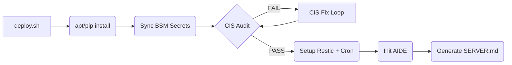
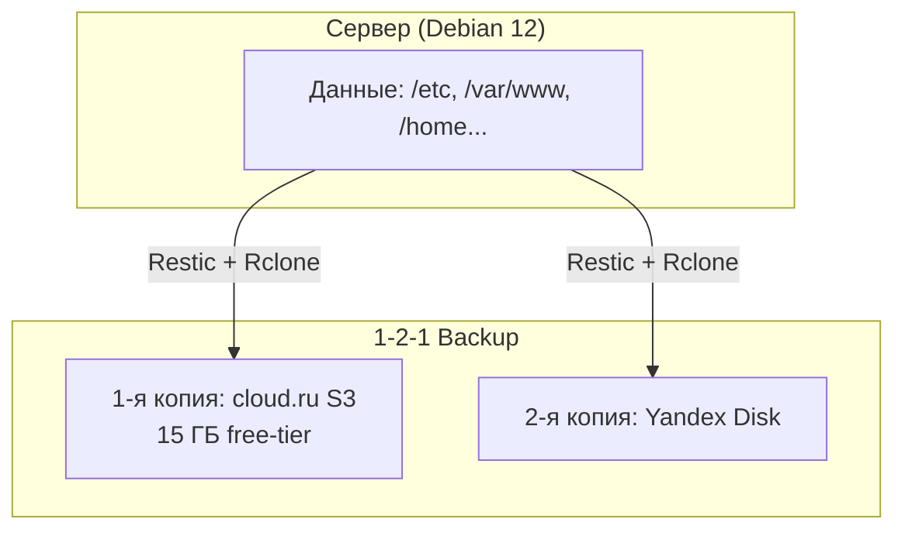

# cloud.ru-free-tier-vm

[](LICENSE)
[](https://www.debian.org/)
[](https://www.python.org/)
[](https://www.cisecurity.org/benchmark/debian_linux)
[](https://cloud.ru/offers/free-tier)

**Превратите голый VPS в production-ready сервер за 5 минут. CIS Benchmark, 1-2-1 backup (S3 + Yandex Disk), секреты из Bitwarden — одной командой.**

## 📑 Содержание
- [Проблема и решение](#-ваш-новый-vps--это-бомба-замедленного-действия)
- [Почему cloud.ru free-tier?](#-почему-cloudru-free-tier)
- [Что вы получите за 5 минут](#-что-вы-получите-за-5-минут)
- [Архитектура и Pipeline](#-архитектура-и-pipeline)
- [Требования (Prerequisites)](#️-требования-prerequisites)
- [Быстрый старт](#-быстрый-старт)
- [Конфигурация](#-конфигурация)
- [Ручное управление](#-ручное-управление)
- [Troubleshooting](#-troubleshooting)
- [Структура проекта](#-структура-проекта)

---

## 🚨 Ваш новый VPS — это бомба замедленного действия

Вы только что создали новый VPS в облаке. Он голый. И вот что вам предстоит сделать, прежде чем он станет безопасным:

❌ **Потратить 4-8 часов** на ручную настройку SSH, firewall, kernel hardening.  
❌ **Разобраться в 59 пунктах CIS Benchmark**, чтобы не пропустить критическую уязвимость.  
❌ **Настроить backup стратегию** с несколькими облачными провайдерами и rotation policy.  
❌ **Придумать, как хранить секреты** без `.env` файлов в репозитории.

**Результат?** Вы либо тратите целый день на рутину, либо (что чаще) пропускаете критичные шаги и надеетесь на лучшее.

### 💀 Цена ошибки
- 🔓 **Взлом через дефолтный SSH** — и ваш проект принадлежит хакерам.
- 💥 **Сбой диска без бэкапа** — и вы теряете месяцы работы и клиентов.
- 📋 **Проваленный аудит compliance** — и вы теряете контракты с enterprise-клиентами.

### ✅ Решение: Production-Ready за 5 минут

Этот проект делает за вас всю грязную работу. Запустите `deploy.sh` — и через 5 минут у вас:

✅ **CIS Debian 12 Level 1** — 59 автоматических проверок безопасности (SSH, Fail2ban, UFW, AIDE, auditd).  
✅ **1-2-1 Backup** — ежедневные бэкапы в cloud.ru S3 и Yandex Disk с автоматическим rotation.  
✅ **Zero-Secret Infrastructure** — все пароли и ключи синхронизируются из Bitwarden Secrets Manager, никогда не касаясь диска.  
✅ **Auto-Documentation** — живой `SERVER.md` с актуальным состоянием вашей инфраструктуры.

### 🎯 Для кого это?

- **👨‍💻 Разработчики и Indie Hackers**: Запускайте pet-projects и стартапы без необходимости быть сисадмином.
- **🛡 DevOps и Sysadmins**: Единый стандарт для всей команды. Новые серверы настраиваются за 5 минут, а не за 5 часов.
- **🏢 Технические лидеры и CTO**: Гарантированный compliance и единый стандарт безопасности во всей инфраструктуре.

---

## 🎁 Почему cloud.ru free-tier?

Этот проект специально оптимизирован под **бесплатный тариф [cloud.ru Evolution](https://cloud.ru/offers/free-tier)**. Вы получаете production-ready инфраструктуру **абсолютно бесплатно**.

### Что входит в free-tier:

| Ресурс | Характеристики | Как используется в проекте |
|--------|----------------|----------------------------|
| **💻 Виртуальная машина** | 2 vCPU (Intel Gold 6248R, 3 ГГц)<br>4 ГБ RAM DDR4<br>30 ГБ SSD NVMe<br>Исходящий трафик не тарифицируется | Debian 12 + CIS hardening + AIDE monitoring + backup cron |
| **📦 Object Storage (S3)** | 15 ГБ хранилища<br>100K операций PUT/POST/LIST<br>1M операций GET/HEAD<br>10 ТБ исходящего трафика | Первая копия бэкапов по стратегии 1-2-1 |

### Идеально подходит для:

- 🌐 **Персональный сайт или блог** — Nginx + Let's Encrypt + автоматические бэкапы
- 🤖 **Telegram-бот** — Python/Node.js runtime с защищенной инфраструктурой
- 🔐 **Менеджер паролей** — Bitwarden self-hosted с enterprise-grade security
- 📁 **Файловое хранилище** — Nextcloud/Seafile с 1-2-1 backup стратегией
- 🎮 **Игровой сервер** — Minecraft/Palworld с мониторингом и бэкапами

### 💡 Экономия

- **0₽** за инфраструктуру (в пределах free-tier лимитов)
- **0 часов** на ручную настройку безопасности
- **0 рисков** потери данных благодаря 1-2-1 backup

> [!TIP]
> **Начните бесплатно:** Создайте аккаунт на [cloud.ru](https://cloud.ru), получите 4000 бонусов при привязке карты, и разверните production-ready сервер без единого рубля затрат.

---

## 🎁 Что вы получите за 5 минут

| Компонент | Что делает | Бизнес-ценность |
|-----------|------------|-----------------|
| **CIS Hardening** | Автоматическое применение 59 проверок Level 1 | Защита от 95% типичных атак, прохождение аудитов |
| **1-2-1 Backup** | S3 + Yandex Disk с rotation, без локальной копии | RPO < 24h, RTO < 1h, защита от ransomware, экономия SSD |
| **Bitwarden Secrets** | Синхронизация 7 секретов через BSM API | Никаких `.env` в репозитории, rotation за 1 клик |
| **AIDE Monitoring** | Мониторинг целостности файловой системы | Детектирование взлома в реальном времени |
| **Auto-Documentation** | Генерация `SERVER.md` с live-данными | Всегда актуальная документация для команды |

---

## 🏗 Архитектура и Pipeline

### Deployment Pipeline


### Стратегия 1-2-1 Backup


---

## ⚙️ Требования (Prerequisites)

Перед запуском убедитесь, что у вас подготовлено:

1. **Чистый сервер** с Debian 12 и доступом по SSH (root или sudo).
   - 💡 *Идеально подходит [cloud.ru free-tier VPS](https://cloud.ru/offers/free-tier): 2 vCPU, 4 ГБ RAM, 30 ГБ SSD*
2. **Bitwarden Secrets Manager (BSM)** — организация с 7 секретами (см. ниже).
   - ✅ **Опционально.** Без BSM создайте `.env` вручную (см. [Секреты](#-секреты))
3. **cloud.ru S3** — Object Storage bucket для второй копии backup.
    - ✅ **Опционально.** Работает только с Yandex Disk
    - 💡 *15 ГБ бесплатно в рамках free-tier*
4. **Yandex Disk** — OAuth-токен с правами на запись в `/backups/`.
    - ✅ **Опционально.** Работает только с S3
5. **GitHub Token** — Personal Access Token (если клонируете приватный репозиторий).

---

## 🚀 Быстрый старт

### Вариант 1: AI Employee (агент)
Скопируйте этот промпт в новую сессию с вашим AI-агентом:

```text
Привет! Настрой сервер по этому репозиторию: https://github.com/mlenkov/cloud.ru-free-tier-vm

Данные для подключения:
IP: <ip>
SSH user: <user>
SSH key: <path>

Секреты:
BW_ACCESS_TOKEN: <token>
```
*Агент сам подключится, установит git, склонирует репо, запустит `deploy.sh` и вернёт отчёт.*

### Вариант 2: Вручную

**1. Подключитесь к серверу и склонируйте репозиторий:**
```bash
ssh user@host
sudo apt update && sudo apt install -y git
git clone https://github.com/mlenkov/cloud.ru-free-tier-vm.git .
```

**2. Настройте конфигурацию** (см. раздел [Конфигурация](#-конфигурация)).

**3. Запустите `deploy.sh`:**

С BSM:
```bash
sudo BW_ACCESS_TOKEN="bws_token_xxx" bash deploy/deploy.sh
```

Без BSM (только облачные хранилища):
```bash
bash deploy/deploy.sh
```
*Скрипт предупредит об отсутствии `.env` и продолжит работу.*

> [!WARNING]
> **Безопасность:** `BW_ACCESS_TOKEN` и другие секреты должны передаваться **только** через переменные окружения. Никогда не коммитьте `.env` файлы и не сохраняйте токены в историю bash!

---

## 📝 Конфигурация

### `backup/config.yaml` — что и куда бэкапить
```yaml
backup:
  sources:              # что бекапим — добавьте свои директории
    - /etc
    - /home
    - /var/www
    - /var/log
    - /root

  schedule: "0 2 * * *"  # ежедневно в 2:00

  retention:              # политика хранения
    keep_daily: 7
    keep_weekly: 4
    keep_monthly: 3

  s3:                     # Copy 1: cloud.ru S3 Object Storage
    bucket: ""            # имя бакета
    endpoint: ""          # URL (без https://)
    prefix: ""            # префикс внутри бакета (опционально)
    region: ru-central-1

  yandex_disk:            # Copy 2: Yandex Disk (offsite)
    path: /backups/cloud.ru-free-tier-vm
```

### 💡 Замечания по CIS Benchmark

> [!NOTE]
> **Автоматический деплой (`deploy.sh`) не применяет checks 8.1–8.3 (Fail2ban).**
>
> На сервере используется key-only SSH (пароль отключён) и nftables с default-deny политикой
> (входящие: только SSH + established connections). При таких настройках fail2ban избыточен:
> брутфорс невозможен (нет пароля), а nftables блокирует на уровне ядра без лишнего потребления RAM.
>
> Все 59 проверок CIS остаются в `cis/standard.yaml`. Для полного аудита:
> ```bash
> python3 cis/manager.py audit
> ```
> Если fail2ban всё же нужен — доставьте вручную:
> ```bash
> apt install fail2ban && systemctl enable --now fail2ban
> python3 cis/manager.py fix --force  # применит оставшиеся checks
> ```

**💡 Оптимизация для free-tier (15 ГБ S3):**
- Установите `keep_daily: 3` вместо 7 для экономии места
- Исключите большие директории из `sources` (например, `/var/log` можно бэкапить отдельно)
- Используйте `prefix: "vps-backup"` для организации нескольких бэкапов в одном бакете

### Секреты

Секреты можно получить одним из двух способов.

#### Вариант А: Bitwarden Secrets Manager (BSM) ✅ рекомендуется

Создайте организацию в BSM и добавьте 7 секретов. `BW_ACCESS_TOKEN` передаётся через env var.

| Ключ в BSM | Описание | Для чего |
|------------|----------|----------|
| `cloudru/s3/access_key` | S3 Access Key | Backup в cloud.ru S3 |
| `cloudru/s3/secret_key` | S3 Secret Key | Backup в cloud.ru S3 |
| `cloudru/s3/bucket` | Имя S3 бакета | Backup в cloud.ru S3 |
| `cloudru/s3/endpoint` | S3 endpoint URL | Backup в cloud.ru S3 |
| `yandex/disk/token` | Yandex Disk OAuth токен | Backup на Yandex Disk |
| `restic/password` | Пароль шифрования restic | Все backup (обязательно) |
| `github/token` | GitHub Personal Access Token | Доступ к репозиторию |

#### Вариант Б: Ручной `.env` ✅ возможно

Создайте файл `.env` в корне проекта:

```bash
cat > .env << 'EOF'
restic/password='мой_надёжный_пароль'
cloudru/s3/access-key='s3_access_key'
cloudru/s3/secret-key='s3_secret_key'
cloudru/s3/bucket='my-bucket'
cloudru/s3/endpoint='s3.cloud.ru'
cloudru/s3/tenant-id=''
yandex/disk/token='yandex_oauth_token'
github/token='ghp_xxx'
EOF
chmod 600 .env
```

**Правила:**
- Обязателен только `restic/password` — без него backup не работает никуда
- Остальные ключи опциональны — соответствующий сервис будет пропущен
- Если есть и BSM, и `.env` — `secrets.py sync` смерджит, приоритет у BSM
- `.env` не должен быть в репозитории (gitignored)

---

## 🛠 Ручное управление

> [!NOTE]
> Эти команды предназначены для продвинутого использования, отладки и ежедневных операций. Для первичной настройки достаточно `deploy.sh`.

### `deploy/deploy.sh` — полный pipeline (entry point)
**Что делает:** Установка одной командой. Зависимости, секреты, CIS fix, backup, AIDE, документация.
После завершения удаляет себя и CI/CD артефакты с сервера.
**Когда использовать:** Первичная настройка или полный reset сервера.

```bash
# С BSM (рекомендуется):
sudo BW_ACCESS_TOKEN="bws_token_xxx" bash deploy/deploy.sh

# Без BSM (только облачные хранилища):
bash deploy/deploy.sh
```

### `cis/manager.py` — CIS аудит и исправление
**Что делает:** Проверяет compliance по 59 пунктам CIS Benchmark и применяет исправления.
**Когда использовать:** Регулярные аудиты, откат изменений, форсированное применение fixes.

```bash
python3 cis/manager.py audit           # проверить compliance (59 проверок)
python3 cis/manager.py fix --force     # применить исправления
python3 cis/manager.py rollback        # откатить последний fix
```

### `backup/backup.py` — управление 1-2-1 backup
**Что делает:** Создание, проверка и восстановление бэкапов по стратегии 1-2-1.
**Когда использовать:** Ручной запуск бэкапа, проверка статусов, аварийное восстановление.

```bash
python3 backup/backup.py create        # создать backup (S3 + Yandex)
python3 backup/backup.py status        # статус репозитория и cron
python3 backup/backup.py list          # список snapshot-ов
python3 backup/backup.py restore       # восстановить из последнего snapshot
```
*Backup автоматически запускается по cron в 2:00 ежедневно.*

### `deploy/secrets.py` — управление секретами
**Что делает:** Синхронизирует секреты из BSM в `.env` (chmod 600), или позволяет создать `.env` вручную.
**Когда использовать:** После изменения секретов в BSM, или при первичной настройке без BSM.

```bash
BW_ACCESS_TOKEN=bws_token_xxx python3 deploy/secrets.py sync   # BSM → .env (с мержем)
BW_ACCESS_TOKEN=bws_token_xxx python3 deploy/secrets.py list   # список ключей в BSM
BW_ACCESS_TOKEN=bws_token_xxx python3 deploy/secrets.py get cloudru/s3/access-key  # один ключ
```
*Никогда не выводит значения в stdout.*

### `deploy/tests/test_deploy.py` — тест deployment пайплайна (SSH)
**Что делает:** Подключается к серверу через `docs/connection.md`, загружает проект,
запускает deploy, проверяет compliance. При неудаче — откат снапшота и retry-петля.
**Когда использовать:** Перед внесением изменений в pipeline.

```bash
sudo python3 deploy/tests/test_deploy.py                # полный цикл с retry
sudo python3 deploy/tests/test_deploy.py --attempts 5   # максимум 5 попыток
```

### Утилиты
```bash
python3 cis/check_compliance.py        # Быстрая проверка ключевых параметров безопасности
python3 deploy/docs_generator.py       # Генерация docs/SERVER.md (live данные сервера)
```

---

## 🚑 Troubleshooting

| Симптом | Причина | Решение |
|---------|---------|---------|
| `dpkg conffile prompt` | Пакет перезаписывает конфиг | `DEBIAN_FRONTEND=noninteractive` (уже в `deploy.sh`) |
| `pip externally-managed` | PEP 668 на Debian 12 | `--break-system-packages` (уже в `deploy.sh`) |
| `aideinit` 100% CPU | AIDE инициализирует БД | `aideinit --background`, проверьте через 5 мин |
| Compliance < 100% | Fix не применился | `audit` → `fix --force` → `audit` (цикл) |
| `BW_ACCESS_TOKEN` not found | Не передан токен | `export BW_ACCESS_TOKEN=...` (никогда в файл!) |
| No space left | Логи или apt кеш | `apt clean && journalctl --vacuum-time=7d` |
| `restore` не работает | Блокировка restic | `restic check && restic unlock` |
| S3 quota exceeded | Превышен free-tier лимит 15 ГБ | Уменьшите `keep_daily` в `backup/config.yaml` или увеличьте тариф |

---

## 📂 Структура проекта

```text
deploy/                 # Провижининг (однократно, удаляется после deploy)
├── deploy.sh           # Оркестратор
├── secrets.py          # Bitwarden sync
├── docs_generator.py   # Генерация SERVER.md
├── templates/
│   └── server.md       # Шаблон документации
└── tests/
    ├── test_deploy.py  # SSH оркестрация + retry
    └── test_secrets.py # Unit тесты
cis/                    # Безопасность (на сервере постоянно)
├── manager.py          # CIS audit + fix
├── standard.yaml       # 59 CIS проверок
├── check_compliance.py # Проверка compliance score
└── data/               # Результаты аудита (gitignored)
backup/                 # Бэкапы (на сервере постоянно)
├── backup.py           # 1-2-1 backup (restic + S3 + Yandex Disk)
└── config.yaml         # Настройки backup
docs/
├── SERVER.md           # gitignored
├── connection.md       # gitignored
├── GUIDE.md            # Полное руководство
└── adr/                # Architectural Decision Records
AGENTS.md               # Инструкции для AI Employee
README.md               # Этот файл
```

---

## 📚 Документация

- **`AGENTS.md`** — инструкции и промпты для AI Employee.
- **`docs/GUIDE.md`** — полное руководство: архитектура, ежедневные операции, restore.
- **`docs/SERVER.md`** *(gitignored)* — live-данные сервера (HW, IP, CIS), генерируется автоматически.
- **`docs/connection.md`** *(gitignored)* — IP/user/key, заполняет агент.
- **`docs/adr/`** — Architectural Decision Records (история принятых решений).

---

## 🤝 Contributing & License

Если вы нашли ошибку или хотите предложить улучшение, пожалуйста, откройте [Issue](https://github.com/mlenkov/cloud.ru-free-tier-vm/issues) или создайте Pull Request.

Проект распространяется под лицензией [MIT](LICENSE).

---

**Готовы превратить свой бесплатный cloud.ru VPS в production-ready сервер за 5 минут?**  
Начните с [Быстрого старта](#-быстрый-старт) →